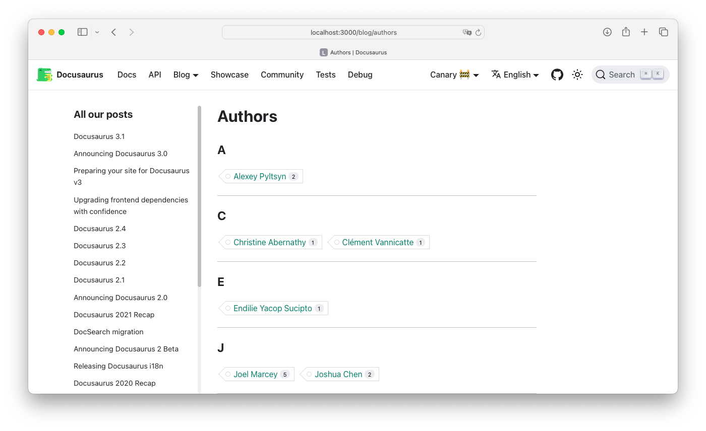
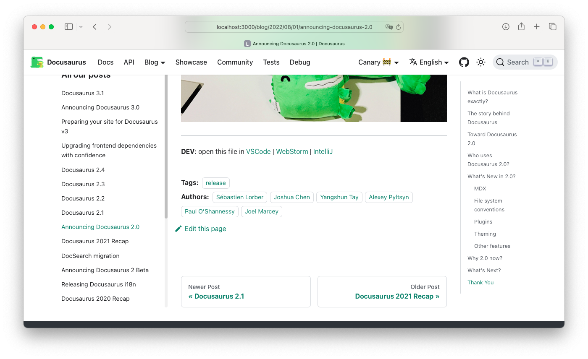
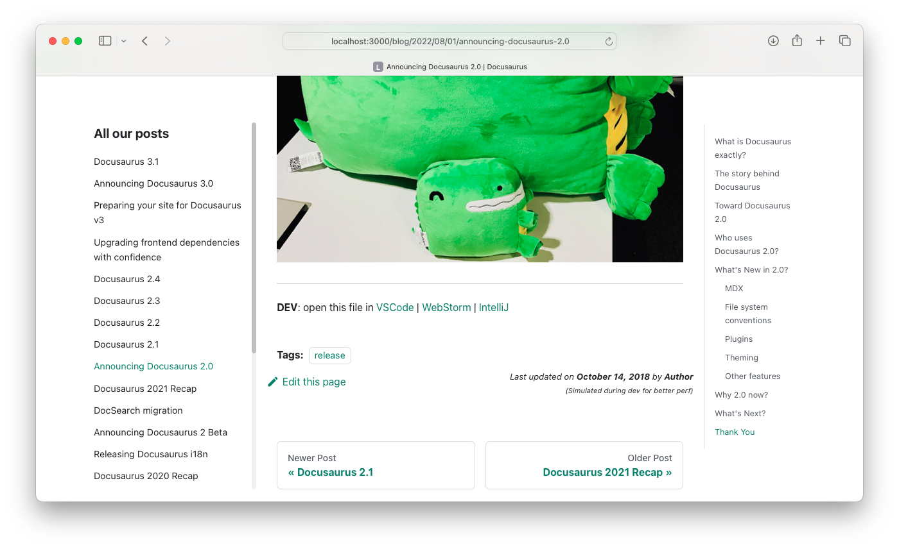
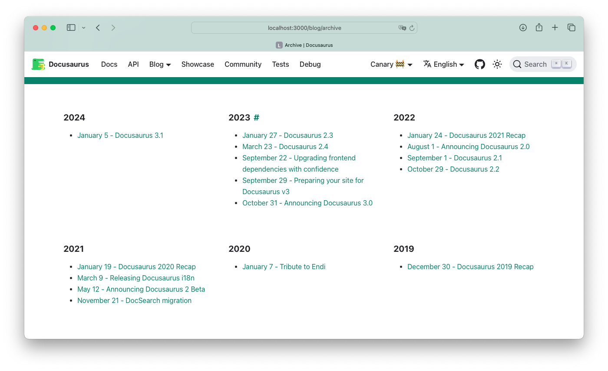
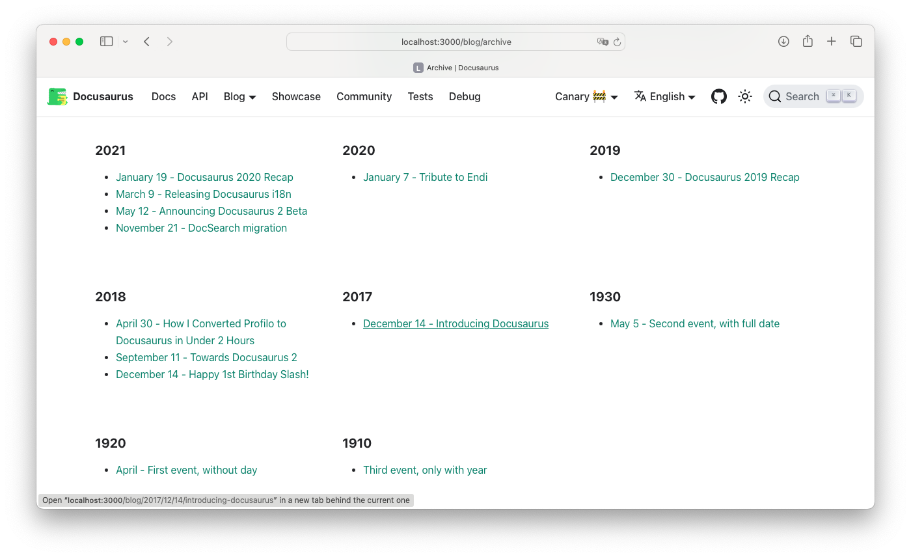

# Docusaurus fork

This is a fork of the [facebook/docusaurus.git](https://github.com/facebook/docusaurus) project.

The updated code is in the `development` branch, while the original code remains in the `main` branch.

The changes, mainly enhancements, are enabled via configuration options, and the defaults should not affect the functionality of the standard Docusaurus project.

The enhancements are listed below.

## Generate grouping pages by Authors, similarly to Tags

For blogs with multiple authors, it is useful to view the pages contributed by each author.

Similarly to the Tags grouping pages, pages to group posts by authors can be generated.



Links to authors are also added at the bottom of the post, as are links to tags:



A new configuration option `generateAuthorsPages` was added; when set to true, the authors pages are generated as `blog/authors` and `blog/authors/${name}`.

Note: Docusaurus allows to define authors identified by a picture, without having to enter a name; these un-named authors are filtered out and not indexed in the Authors pages.

## Add `showLastUpdateTime` and `showLastUpdateAuthor` to blog posts

In some cases, for example sites with research data, the content of the posts is expected to be updated in time, as new data is discovered.

To help users identify updated content, it is useful to know the last updated time and provide a way to order post by it.



The mechanism of computing the last updated time based on the latest git commit time, is already used for docs; the same mechanism was also added to blog posts, using the same configuration options, `showLastUpdateTime` and `showLastUpdateAuthor`.

When enabled, the last update time is displayed below the post and also used when sorting the posts in the feed files.

## Hide redundant year in dates shown in the Archive page

In the Archive page, when listing the the post titles grouped by years, there is not need to show the year again, since it is redundant.



For aesthetic reasons, a new configuration option `hidePostYearInArchive` was added; when set to true, the date format is adjusted to no longer show the year.

## Improve support for posts related to events in the past

The common use case for blogs is to document recent events, for which the post date and the event date are the same.

For blogs documenting historical events, the post date can follow the same rule and remain in the present, but the event date should be entered as a separate frontMatter string property.

Since some historical events do not have an exact date, this property can be incomplete, without day or even month, for example:

```txt
event_date: '1994'
event_date: '1994-11'
event_date: '1994-11-07'
```

For events that lasted more than one day, it is possible to also define the end date, as a string with the similar incomplete syntax:

```txt
event_end_date: '1995'
event_end_date: '1994-12'
event_end_date: '1994-11-08'
```

To enable this feature, a new configuration option `sortPostsByEventDate` was added; when set to true, the event dates are parsed, and, if present, these dates are used when sorting the posts in the Archive page, so the past events are located when they happened, not when they were entered in the blog.



## Add `pageBasePath` to blog plugin configuration

In Docusaurus the URL parts used to compose the pages paths are configurable via options like `routeBasePath`, `tagsBasePath`, etc, but in the path used for multi-page lists, the URL was hard-coded as `page`.

For consistency reasons, a new configuration option was added, `pageBasePath`, allowing to also configure these paths, a feature useful for example when all paths are translated to local languages.

---

The original README content follows:

<div align="center">
  <h1 align="center">
    Docusaurus
    <br />
    <br />
    <a href="https://docusaurus.io">
      
    </a>
  </h1>
</div>

<p align="center">
  <a href="https://twitter.com/docusaurus"></a>
  <a href="#backers" alt="sponsors on Open Collective"></a>
  <a href="#sponsors" alt="Sponsors on Open Collective"></a>
  <a href="https://www.npmjs.com/package/@docusaurus/core"></a>
  <a href="https://github.com/facebook/docusaurus/actions/workflows/tests.yml"></a>
  <a href="CONTRIBUTING.md#pull-requests"></a>
  <a href="https://discord.gg/docusaurus"></a>
  <a href= "https://github.com/prettier/prettier"></a>
  <a href="#license"></a>
  <a href="https://github.com/facebook/jest"></a>
  <a href="https://argos-ci.com" target="_blank" rel="noreferrer noopener" aria-label="Covered by Argos"></a>
  <a href="https://gitpod.io/#https://github.com/facebook/docusaurus"></a>
  <a href="https://app.netlify.com/sites/docusaurus-2/deploys"></a>
  <a href="https://vercel.com/new/clone?repository-url=https%3A%2F%2Fgithub.com%2Ffacebook%2Fdocusaurus%2Ftree%2Fmain%2Fexamples%2Fclassic&project-name=my-docusaurus-site&repo-name=my-docusaurus-site"></a>
  <a href="https://app.netlify.com/start/deploy?repository=https://github.com/slorber/docusaurus-starter"></a>
</p>

## Introduction

Docusaurus is a project for building, deploying, and maintaining open source project websites easily.

Short on time? Check out our [5-minute tutorial ⏱️](https://tutorial.docusaurus.io)!

**Tip**: use **[docusaurus.new](https://docusaurus.new)** to test Docusaurus immediately in a playground.

- **Simple to Start**

> Docusaurus is built in a way so that it can [get running](https://docusaurus.io/docs/installation) in as little time as possible. We've built Docusaurus to handle the website build process so you can focus on your project.

- **Localizable**

> Docusaurus ships with [localization support](https://docusaurus.io/docs/i18n/introduction) via CrowdIn. Empower and grow your international community by translating your documentation.

- **Customizable**

> While Docusaurus ships with the key pages and sections you need to get started, including a home page, a docs section, a [blog](https://docusaurus.io/docs/blog), and additional support pages, it is also [customizable](https://docusaurus.io/docs/creating-pages) as well to ensure you have a site that is [uniquely yours](https://docusaurus.io/docs/styling-layout).

## Installation

Use the initialization CLI to create your site:

```bash
npm init docusaurus@latest
```

[Read the docs](https://docusaurus.io/docs/installation) for any further information.

## Contributing

We've released Docusaurus because it helps us better scale and supports the many OSS projects at Facebook. We hope that other organizations can benefit from the project. We are thankful for any contributions from the community.

### [Code of Conduct](https://code.fb.com/codeofconduct)

Facebook has adopted a Code of Conduct that we expect project participants to adhere to. Please read [the full text](https://code.fb.com/codeofconduct) so that you can understand what actions will and will not be tolerated.

### Contributing guide

Read our [contributing guide](https://github.com/facebook/docusaurus/blob/main/CONTRIBUTING.md) to learn about our development process, how to propose bugfixes and improvements, and how to build and test your changes to Docusaurus.

### Beginner-friendly bugs

To help you get your feet wet and get you familiar with our contribution process, we have a list of [beginner-friendly bugs](https://github.com/facebook/docusaurus/labels/good%20first%20issue) that might contain smaller issues to tackle first. This is a great place to get started.

## Contact

We have a few channels for contact:

- [Discord](https://discord.gg/docusaurus):
  - `#general` for those using Docusaurus.
  - `#contributors` for those wanting to contribute to the Docusaurus core.
- [@docusaurus](https://twitter.com/docusaurus) on Twitter
- [GitHub Issues](https://github.com/facebook/docusaurus/issues)

## Contributors

This project exists thanks to all the people who contribute. [[Contribute](CONTRIBUTING.md)]. <a href="https://github.com/facebook/docusaurus/graphs/contributors"></a>

## Backers

Thank you to all our backers! 🙏 [Become a backer](https://opencollective.com/Docusaurus#backer)

<a href="https://opencollective.com/Docusaurus#backers" target="_blank"></a>

## Sponsors

Support this project by becoming a sponsor. Your logo will show up here with a link to your website. [Become a sponsor](https://opencollective.com/Docusaurus#sponsor)

<a href="https://opencollective.com/Docusaurus/sponsor/0/website" target="_blank"></a> <a href="https://opencollective.com/Docusaurus/sponsor/1/website" target="_blank"></a>

## License

Docusaurus is [MIT licensed](./LICENSE).

The Docusaurus documentation (e.g., `.md` files in the `/docs` folder) is [Creative Commons licensed](./LICENSE-docs).

## Special thanks

<p>
  <a href="http://www.browserstack.com/" target="_blank">
    <picture>
      <source media="(prefers-color-scheme: dark)" srcset="./admin/img/browserstack-dark-mode-logo.svg#gh-dark-mode-only">
      
    </picture>
  </a>
</p>

[BrowserStack](http://www.browserstack.com/) supports us with [free access for open source](https://www.browserstack.com/open-source).

[](https://rocketvalidator.com/)

[Rocket Validator](https://rocketvalidator.com/) helps us find HTML markup or accessibility issues.
